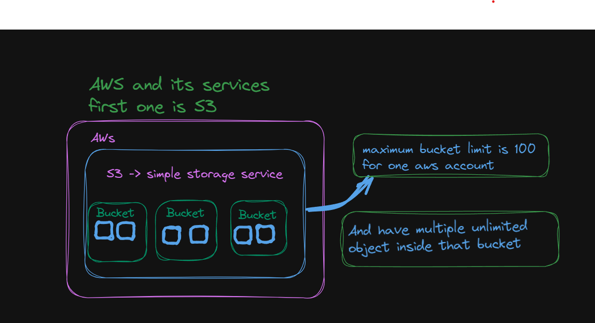

# AWS- Amazon Web Services
<h2>Important key points of AWS::::::</h2>
<ul>

<li>Lambda ::::function -- this is also used in serverless  </li>
<li>EC2--> Elastic compute cloud which provides secure,resizable compute capacity in the cloud.....  </li>
<li>S3 :: simple storage services</li>
<li>IAM is for permissions </li>
<li>Amazon simple Email service </li>
<li>Elasctic Container Service </li>
<li>API Gateway --->> it is actually used in serverless </li>

</ul>

# S3 services and its structure

one amazon account has 100 bucket limit with unlimited storage inside it

one bucket is used to store the data of one project

# presigned url

when we declare the bucket as a private one..then when we add any images or file then it can not be accessed publicly.....we can access through the help of presigned url.....

