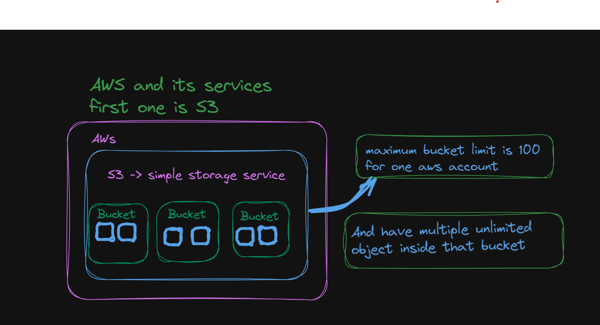
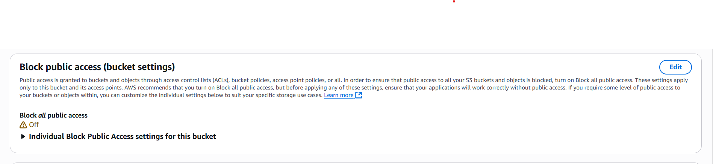
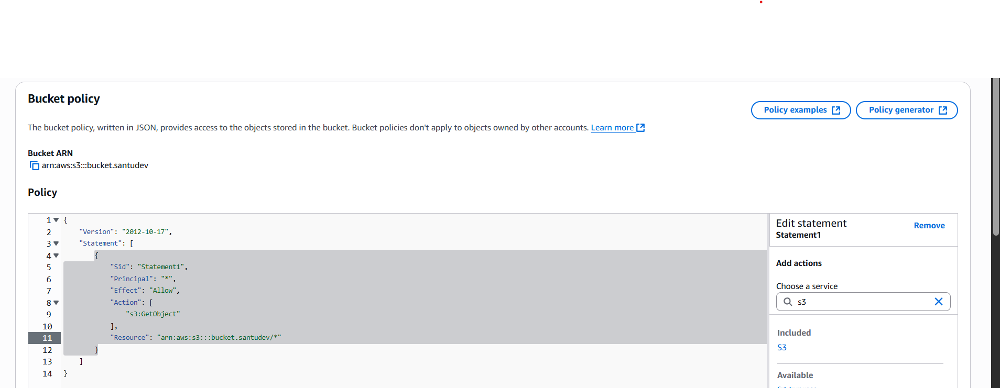

# AWS- Amazon Web Services

<h2>Important key points of AWS::::::</h2>
<ul>

<li>Lambda ::::function -- this is also used in serverless  </li>
<li>EC2--> Elastic compute cloud which provides secure,resizable compute capacity in the cloud.....  </li>
<li>S3 :: simple storage services</li>
<li>IAM is for permissions </li>
<li>Amazon simple Email service </li>
<li>Elasctic Container Service </li>
<li>API Gateway --->> it is actually used in serverless </li>

</ul>

# S3 services and its structure

one amazon account has 100 bucket limit with unlimited storage inside it

one bucket is used to store the data of one project

# presigned url

when we declare the bucket as a private one..then when we add any images or file then it can not be accessed publicly.....we can access through the help of presigned url.....

# AWS tutorial

# AWS --- "IAM"

There is two user for the AWS account console. ROOT user is used by the admin of the account to login into the account.

IAM user account is used by the other sub users created by the root user with different roles and permissions.

NOTE: To perform critical works like deployment we must use IAM user account. ROOT account must be used for handling the account.

We can add permissions to the particular directly but there is limitation for that. Only 10 permissions can be add directly. Therefore it is recommended to use groups options so that we can give multiple permissions and later on we can add user on that group.

Task Completed:

26/09/2025

# Created two IAM user and assigned policy separately.

# Problem:

If we have 1000 of staffs with different roles and permissions then it will be complicated to handle this permissions separately.

# solution:

Use of group is the best solution for this. As we can create different different group where we can assigned policy or permissions as per the requirements and we can add the respective users into that group. It makes the life much more easier.

# S3 - simple storage service

S3 services provide multiple buckets, inside each bucket we can store images videos, other static files.

One AWS account can have 100 S3 buckets.

Important notes:

<li>Bucket name must be unique globally as it is used by the AWS as sub domain</li>

<li>Public access settings for the bucket: If we select block all public access then the folders, files or images stored in S# bucket can not accessed publicly.</li>

# To change the accessibility

<li>We need to turn off the block all public access options as seen in the image below:</li>

<li> We also need to update the bucket policy: </li>

# We need to make following changes in the bucket policy:

Note: This changes can be only made by the root user. IAM user can not make this policy changes.

Outcome: in this way the images or any files uploaded into the S3 bucket can be accessible publicly.

# We can not delete the bucket directly if it has some files or folders or images. In that case we need to first empty the bucket and then only we can delete the bucket.

